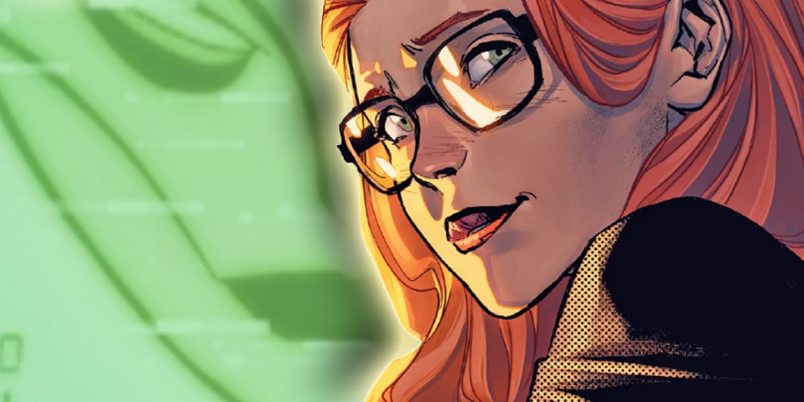

 

$\color{#664e6b}{\textsf{Please Be My Friend!!}}$

  

$\color{#402a55}{\textsf{Barbara Joan Gordon.}}$

 
 
 

$\color{#ab99b8}{\textsf{✩░▒▓▆▅▃▂▁𝕲𝖔𝖙𝖍𝖆𝖒𝕮𝖎𝖙𝖞▁▂▃▅▆▓▒░✩}}$

 

$\color{#664e6b}{\textsf{⛧°.⋆Favorite Song!!⋆.°⛧}}$
 

https://github.com/user-attachments/assets/4efd9f6f-37c8-4701-9f8d-aeee3de11c2b

 

 
 

